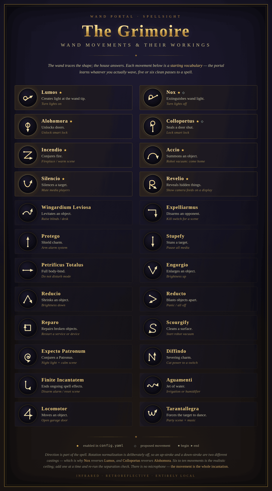

# Wand Portal

IR wand gesture recognition that turns spells into Home Assistant entities over MQTT.

> **Working on this project?** Start with [SPEC.md](SPEC.md) for the design and
> phased requirements, [CLAUDE.md](CLAUDE.md) for conventions and invariants, and
> [docs/HARDWARE.md](docs/HARDWARE.md) for optics and enclosure notes.
> This README covers the Phase 1 software only.

Point an IR-illuminated camera at a room, wave a wand with a retroreflective tip,
and every recognized spell pulses a `binary_sensor` in Home Assistant. What that
sensor does is entirely up to your automations.

Built on the same idea as [Gloworm72/Interactive-Wand-Gesture-Recognition](https://github.com/Gloworm72/Interactive-Wand-Gesture-Recognition),
with three changes that matter for a home-automation install:

| | That project | This one |
|---|---|---|
| Classifier | SVM, ~400 hand-drawn traces, 2 spells | Normalized template matching, ~5 waves per spell, 45 in the catalog |
| Output | Servos, LEDs, sound on the Pi | MQTT with Home Assistant auto-discovery |
| Training | Offline dataset scripts | Web console you use from your phone while waving the wand |

---

## Hardware

- **Camera** — any USB camera with the IR-cut filter removed, plus IR illuminators.
  The cheap "night vision" ESP/USB modules with a ring of 850nm LEDs work well.
  940nm is less visible to the eye but dimmer; 850nm gives a stronger return.
- **Wand** — a dab of 3M retroreflective tape on the tip. This is the whole trick:
  the tape returns the IR straight back to the lens and reads as the brightest
  object in the frame by a wide margin.
- **Host** — Raspberry Pi 4 or 5, or any Docker host with the camera attached.
  640×480 at 30fps costs roughly 15% of one Pi 4 core.

Mount the camera so the illuminators sit as close to the lens axis as possible.
Retroreflection is directional — LEDs off to the side kill your signal.

---

## Run it

### Docker

```bash
cp config.yaml config.local.yaml     # edit mqtt.host at minimum
docker compose up -d --build
```

Then open `http://<host>:8080`.

The compose file mounts `./data` for the trained templates, so your spells
survive a rebuild. A USB camera can't be scheduled across a swarm, so if you
deploy this as a stack, pin it to the node the camera is plugged into with a
`node.hostname` placement constraint.

### Directly on a Pi

```bash
python3 -m venv .venv && source .venv/bin/activate
pip install -r requirements.txt
python -m wandportal -c config.yaml
```

Useful flags: `--no-server` (headless), `--list-spells`, `-v`.

Every config value has an environment override, shaped `WAND_<SECTION>_<KEY>`:

```bash
WAND_MQTT_HOST=192.168.0.40 WAND_TRACKER_THRESHOLD=235 python -m wandportal
```

---

## Set it up, in order

**1. Tune the blob.** Open the console, switch to **Tune**. The view becomes the
raw threshold mask. Raise the brightness cutoff until the wand tip is the only
white dot in the frame — no lamps, no window, no reflection off a picture frame.
This step decides whether everything downstream works.

**2. Wire up Home Assistant before you train.** Open any spell and press
*Send to Home Assistant*. The entity should appear under a **Wand Portal** device
and flick on for three seconds. Build the automation now, while you can fire it
on demand.

**3. Train.** Switch to **Train**, open a spell, press *Record samples*. Wave the
gesture five or six times, the same way each time, at the same distance. Each
clean pass appears as a thumbnail — delete any that look wrong. Repeat per spell.

[`docs/images/spellbook.png`](docs/images/spellbook.png) is a reference chart of
wand movements for 24 of the catalog's spells — a starting vocabulary, not a
requirement, since the recognizer learns whatever you actually wave. Regenerate
it from the catalog with `python tools/make_spellbook.py`.



**4. Check separation.** Back in Tune, press *Check spell separation*. This runs
leave-one-out over your stored samples and names any pair that reads as each
other. If Lumos and Incendio are getting confused, redraw one of them rather than
lowering the confidence threshold.

**5. Cast.** Switch to **Cast**. The log shows what fired and what was rejected
and why.

### On how many spells to train

The catalog has 45, but distinct in-air gestures run out fast. Six to ten is the
realistic ceiling for reliable recognition — real wand attractions use about that
many. Add spells one at a time and re-run the separation check each time; when
accuracy starts dropping, you've found your limit. Gestures that differ in
*direction* as well as shape separate best (a clockwise loop vs. a
counter-clockwise one, an up-stroke vs. a down-stroke), since rotation
normalization is deliberately off.

---

## Home Assistant

Discovery is automatic. Each enabled spell becomes `binary_sensor.wand_<id>`,
plus a `sensor.wand_last_spell` carrying the spell name with confidence and
duration as attributes. All of them group under one device, so removing the
integration removes every entity.

```yaml
automation:
  - alias: Lumos lights the room
    triggers:
      - trigger: state
        entity_id: binary_sensor.wand_lumos
        to: "on"
    actions:
      - action: light.turn_on
        target:
          entity_id: light.living_room
        data:
          brightness_pct: 100

  - alias: Nox darkens it
    triggers:
      - trigger: state
        entity_id: binary_sensor.wand_nox
        to: "on"
    actions:
      - action: light.turn_off
        target:
          entity_id: light.living_room
```

Or drive everything from one trigger using the JSON event topic:

```yaml
  - alias: Announce any spell
    triggers:
      - trigger: mqtt
        topic: wand/event
    actions:
      - action: tts.speak
        data:
          message: "{{ trigger.payload_json.name }}"
```

### Topics

| Topic | Payload |
|---|---|
| `wand/status` | `online` / `offline` (retained, LWT) |
| `wand/spell/<id>/state` | `ON` then `OFF` after `pulse_seconds` |
| `wand/last_spell` | Display name, retained |
| `wand/last_spell/attributes` | `{spell_id, confidence, duration, effect, cast_at}` |
| `wand/event` | `{spell, name, confidence}`, not retained |

Renaming or removing spells leaves stale retained discovery configs behind.
`POST /api/discovery` republishes; to clear the old ones, call
`remove_discovery()` before changing the spell list, or delete the retained
`homeassistant/binary_sensor/wand/...` topics by hand.

---

## How recognition works

A gesture is a path, not an image. Each cast is resampled to 64 evenly spaced
points, scaled uniformly (so a flat swipe stays flat), centered, flattened to a
128-dimensional unit vector, and compared to every stored sample by cosine
similarity. It's a $1 Recognizer variant with rotation normalization disabled.

A cast is published only if the best match clears `min_confidence` **and** beats
the runner-up by `min_margin`. That second test is what stops a sloppy wave from
picking one of two similar spells at random — raise it if you get wrong-spell
firings, raise `min_confidence` if you get spurious ones.

Because there's no model to fit, adding a spell costs one training session and
zero retraining of the others. Templates live in a plain JSON file you can copy
between installs.

---

## Layout

```
wandportal/
  camera.py        threaded capture, always returns the newest frame
  tracker.py       threshold → contours → centroid, and gesture segmentation
  recognizer.py    resample, normalize, match, persist
  mqtt_bridge.py   MQTT client + Home Assistant discovery
  engine.py        the capture→track→classify→publish loop
  server.py        FastAPI: MJPEG stream, training and tuning API
  spells.py        45-spell catalog
  web/index.html   the console
```

`smoke_test.py` and `api_test.py` run without a camera or a broker — both are
worth running after any change to the tracker or recognizer.

---

## Tuning notes

| Symptom | Try |
|---|---|
| Trail breaks mid-cast | Raise `lost_frames`, or lower `threshold` slightly |
| Random short casts | Raise `min_path_length` and `min_points` |
| A lamp gets tracked | Raise `threshold`; lower `max_area` if it's a large source |
| Track jumps to a reflection | Lower `max_jump` |
| Trail is jagged | Raise `smoothing` toward 0.6 |
| One spell fires as another | Raise `min_margin`, retrain the weaker one differently |
| Nothing ever matches | Lower `min_confidence` to 0.75 and re-check separation |
| Casts double-fire | Raise `cooldown` |
